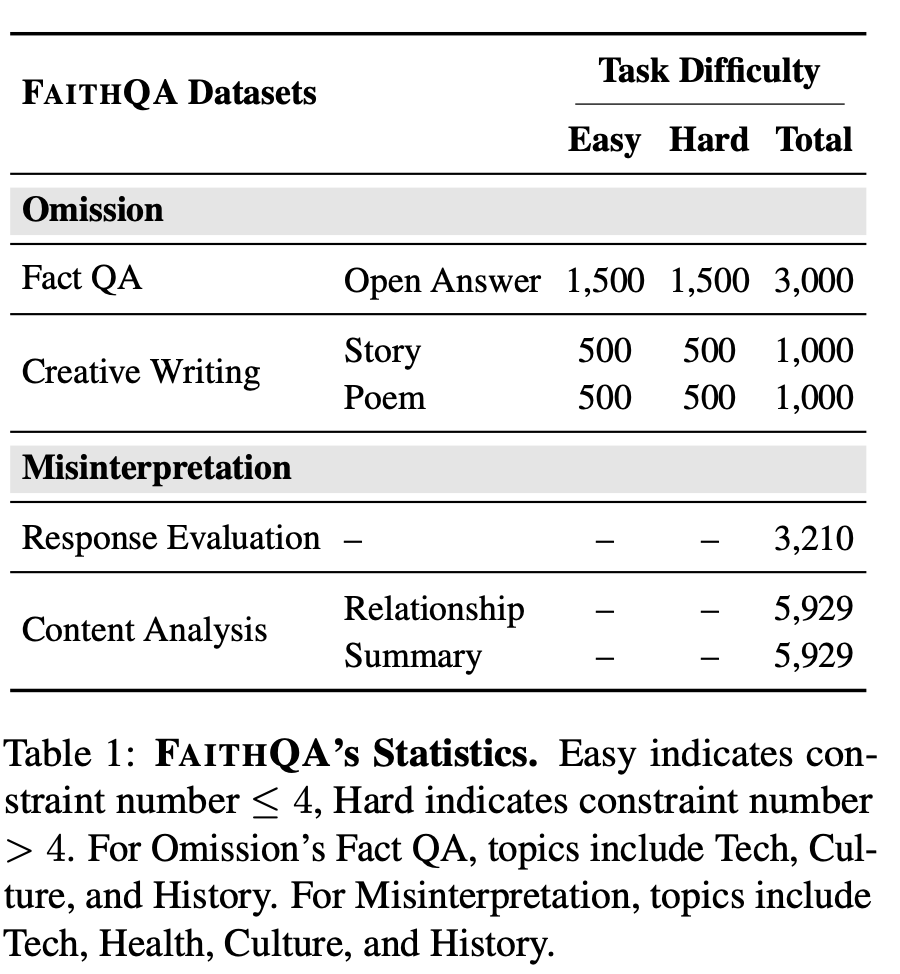
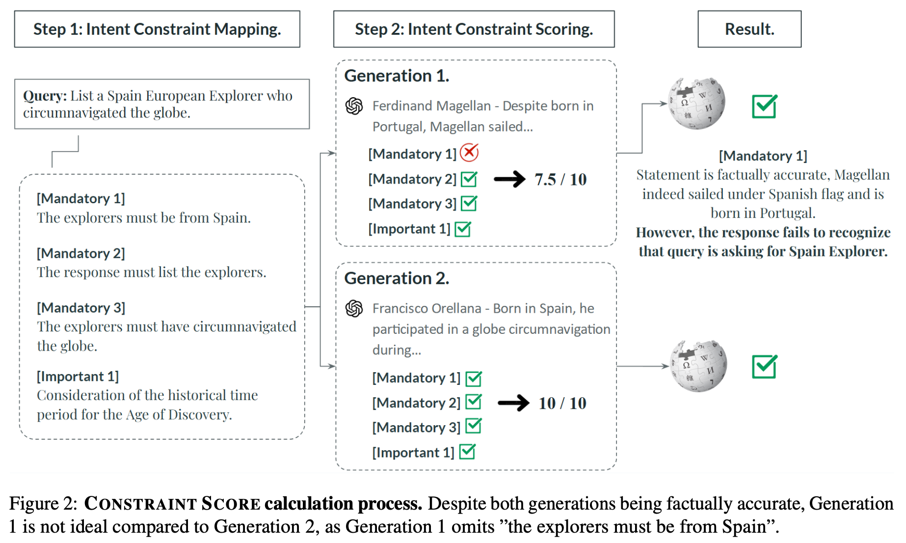
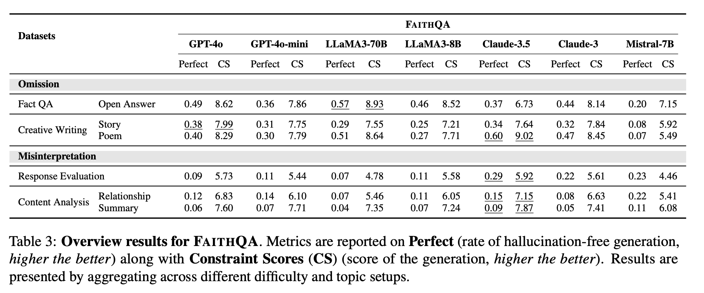

---
tags:
  - paper
  - research
status: 🟩 Done
authors:
conference: ACL
year: 2025
link: https://aclanthology.org/2025.acl-long.349/
priority: ⭐⭐⭐
created: 2026-01-10
---

# Beyond Facts: Evaluating Intent Hallucination in Large Language Models

---

## 🔑 Key Contributions

- Define "intent hallucination" as a distinct category of error separate from factual hallucination
- Introduce FAITHQA to evaluate intent hallucination
- Introduce new automated evaluation metric called "CONSTRAINT SCORE" to evaluate how well the response adheres to the set of intent constraints of question.

## 📝 Summary

> [!summary] TL;DR
> This paper introduce intent hallucination and proposes the FAITHQA benchmark and CONSTRAINT SCORE metric to demonstrate that even SOTA models frequently struggle to follow complex user intent faithfully

### Background & Motivation

- As users are entrusting LLM with increasingly complex queries, it is critical to ensure the output is also intentionally aligned with the user's query
- The paper pivots the conversation from factual accuracy to a more nuanced problem
  - LLM often fails to adhere to the specific constraints of a user query in two primary ways
  - Omission : The model neglects or ignores components of the users' query
  - MisInterpretation : The model respond to concepts or actions that are not mentioned
- To systematically identify and quantify these failures, the authors developed a novel evaluation methodology, including a specialized benchmark and a corresponding scoring metric

### Methodology

- The FAITHQA Benchmark
  - Comprising 20,068 problems
  - Omission tasks use complex, multi-constraint queries
  - Misinterpretation use a RAG setup to test if the model incorrectly assumes the information is present and invents a response

- The CONSTRAINT SCORE Metric - This metric evaluates a model's response through a two-step - 1) Intent Constraint Mapping : decompose user query into a set of simple, atomic requirements called Intent Constraints. And these constraints are categorized by importance - Mandatory : ex) subject, action - Important : ex) qualifiers, quantitiy - Optional : desirable but not-essential details - 2) Intent Constraint Scoring : assign binary score for each constraint and a final weighted score out of 10

### Experiments & Results

- CONSTRAINT SCORE aligns with human judgement
  - MSE with human scores is much lower than LLM as judge scores with lower deviation
- Performance degrades with Complexity
  - 'Perfect' response rate was significantly lower on 'Hard Tasks'
- Intent Hallucination is prevalent
  - Even GPT-4o only achieved a 'Perfect' score of 6%
- Factual checks are insufficient for Large Models
  - Even though Large Model produce fewer factually incorrect responses, Larger models consistently show a lower Factual Verifiable Hallucination Rate, which means it becomes more challenging to detect hallucinations through factual checks as model size grows

---

## 💭 Critical Analysis / Thoughts

> [!quote] My Take
> Even though they pivots traditional factual qa into a more nuanced problem, Selection of models are not enough(no reasoning model) and the way they categorize intent is too narrow

- **Pros**:
  - Novel Problem Formulation
  - Comprehensive Benchmark
  - Human aligned evaluation metrics
  - Insights into LLM failures
- **Cons**:
  - Coarse-Grained Categorization
  - Exclusion of Reasoning-Focused Models

---

## 🔗 References & Links

- https://aclanthology.org/2025.acl-long.349/](URL)
